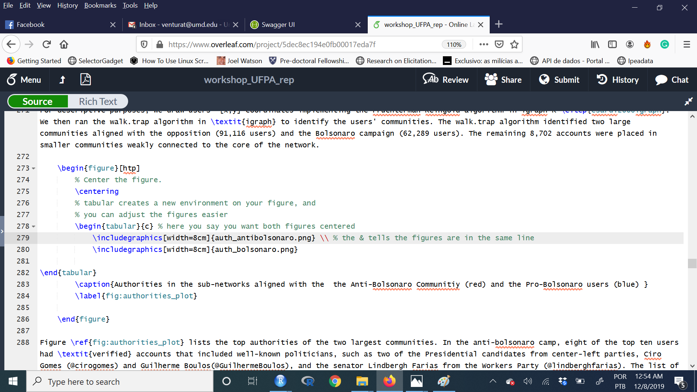
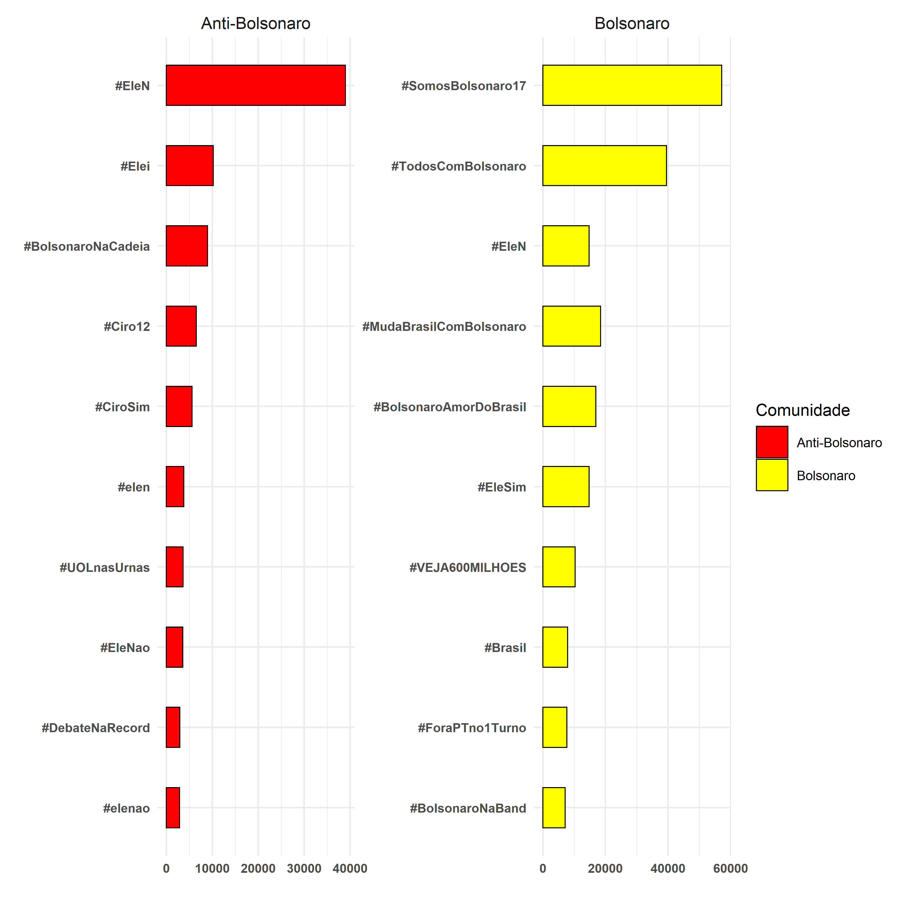
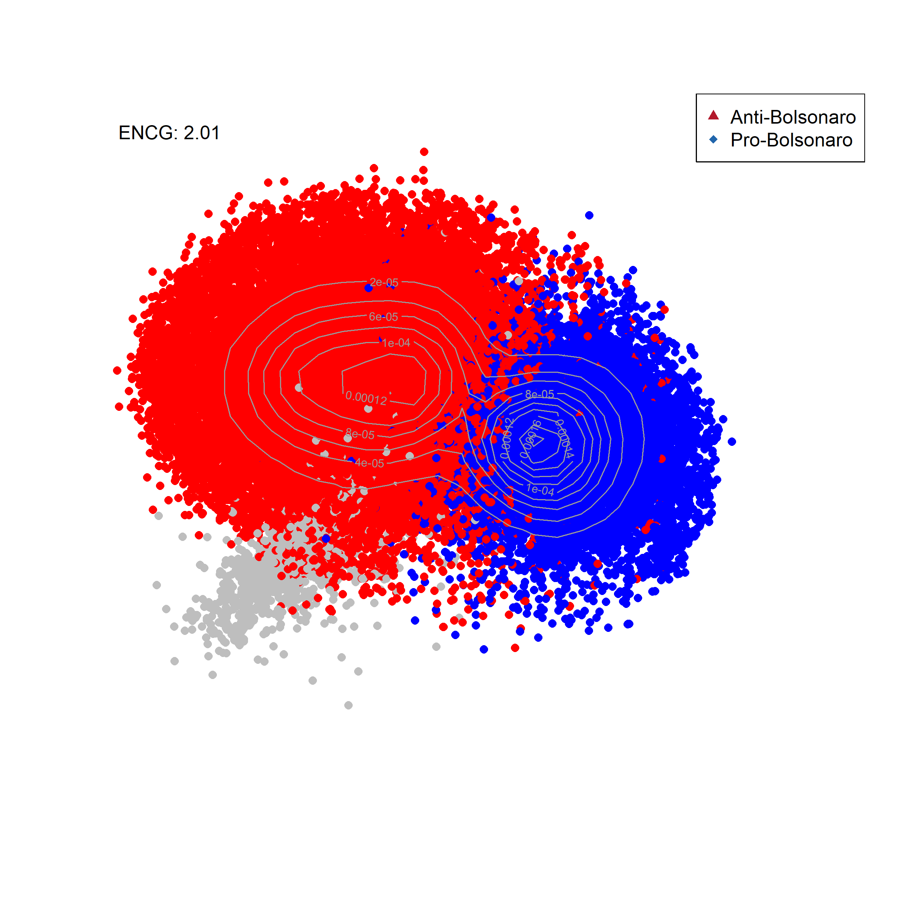

```{r echo=FALSE}
# Chunck base
library(knitr)
opts_chunk$set(cache=TRUE,
               prompt=FALSE,
               tidy=TRUE,
               comment=NA,
               message=FALSE,
               warning=FALSE)


```


# Introdução

O objetivo do dia de hoje é replicar uma análise do início ao fim utilizando dados do Twitter. Isso nos dará prática acadêmica em análise de dados do twitter e em análise de redes Objetivo também mostrar para vocês um pouco como eu produzo minhas pesquisas, combinando a análise em R com a escrita acadêmica. 

Vamos replicar parte da análise de dados do meu artigo com Ernesto Calvo e Natalia Aruguete [Polarization, News Sharing, and Gatekeeping: A study of the Bolsonaro Election](http://tiagoventura.rbind.io/files/Sharing_News_in__Bolsonaro.pdf). Vamos focar principalmente na parte descritiva do paper. Os modelos estatísticos abordam métodos que não cubrimos aqui, e ficarão para o próximo curso em 2020. Este paper ainda está em andamento, portanto, peço algum cuidado antes de compartilhá-lo. A  maior parte destes códigos abaixo são emprestados de [Ernesto Calvo](http://gvptsites.umd.edu/calvo/)

Todo o material para o dia de hoje está disponível neste [link](https://www.dropbox.com/sh/kcpofgb7qf2ukrp/AACFKGDPaPSCvSRvrk_WAK8Sa?dl=0). Baixe todos os arquivos em uma pasta, e direcione o R para esta pasta usando a função `setwd` para definir sua estação de trabalho. 

# Abrindo o banco de dados

O primeiro passo é abrir o banco de dados. Nós coletamos dados do twitter na semana anterior ao segundo turno da eleição no Brasil. Para este artigo, utilizamos um programa em `Python` para fazer o download dos dados. Por isto, o formato dos dados é ligeiramente diferente do que vimos anteriormente. 

```{r}

# Ative os pacotes

library(tidyverse)
library(igraph)
library(data.table)
library(arm)
library(broom)
library(RColorBrewer)
library(KernSmooth)


# Abra o banco de dados
getwd()
#setwd("./html/dia_03/")
load("dados_bolsonaro.RData")
summary(dados_bolsonaro)
```

# Pensando em Redes

Há milhões de formas de análisar dados de twitter. Porém, um dos elementos centrais em plataformas como estas é o fato dos usuários interagirem entre si. Portanto, estes usuários se conectam em redes. Uma rede possui dois elementos básicos: um nó - usuário - e um link - que iremos considerar um retweet. Por isso, construíremos uma rede de retuítes entre usuários. 

No banco de dados, as variáveis que terminam com T são referentes ao usuário que foi retuitado e as com RT se referem aos que retuitaram. Desta forma, a ligação entre T e RT formam os links desta rede. 

Para construir a rede de conexões, vamos usar o pacote `igraph`. Este pacote armazena dados de forma um tanto distinta, porém, é a forma mais intuitiva de manipular dados de rede em R. 


```{r}

# Construíndo uma rede

# Passo 1: Selecione os nós -- Autoridades -> Hub

data <- cbind(dados_bolsonaro$namehub, dados_bolsonaro$nameauth)
head(data)


# Passo 2: Crie a estrutura da rede
net <- graph.empty() # Cria um gráfico vazio
net <- add.vertices(net, length(unique(c(data))),
                      name=as.character(unique(c(data)))) # número de nós
net <- add.edges(net, t(data))

summary(net)

# Passo3: Adicione as variáveis

E(net)$text <- dados_bolsonaro$text
E(net)$tweetidT <- dados_bolsonaro$tweetidT
E(net)$tweetidRT <- dados_bolsonaro$tweetidRT
E(net)$friendsT <- dados_bolsonaro$friendsT
E(net)$followersT <- dados_bolsonaro$followersT
E(net)$friendsRT <- dados_bolsonaro$friendsRT
E(net)$followersRT <- dados_bolsonaro$followersRT
E(net)$timeRT <- dados_bolsonaro$timeRT
E(net)$timeT <- dados_bolsonaro$timeT
E(net)$verifiedRT <- dados_bolsonaro$verifiedRT 
E(net)$verifiedT <- dados_bolsonaro$verifiedT
E(net)$nameauth <- dados_bolsonaro$nameauth
E(net)$namehub <- dados_bolsonaro$namehub
E(net)$web <- dados_bolsonaro$web
E(net)$device <- dados_bolsonaro$device 

summary(net)

```

O próximo passo é calcular algumas estatísticas que produzem redes de conexões como as que vemos circulando em sites por aí. Para isso, há dois processos. Ambos consistem em aplicar algoritimos para extrair informações da rede. Primeiro, construímos um layout -- achamos pontos para os nós em duas dimensões - e depois identificamos quantas comunidades temos na nossa rede. 

O código abaixo ensina como fazer isto. Porém, ambos os processos são muito intensos do ponto de vista computacional. Por isso, eu já salvei os objetos. 

```{r}

# Adicionar indegree and outdegree
V(net)$outdegree<-degree(net, mode="out")
V(net)$indegree<-degree(net, mode="in")

# Não rode isso. Vai travar seu PC

# Layout
# system.time(l <- layout_with_fr(net, grid = c("nogrid")))

#Comunidades
#my.com.fast <- walktrap.community(net)

# Abrindo o material salvo
load("vertices_bolsonaro.Rdata")

# Adicionando a rede

V(net)$l1 <- vertices_bolsonaro$l1
V(net)$l2 <- vertices_bolsonaro$l2
V(net)$membership <- vertices_bolsonaro$membership

summary(net)


```

## Quais as maiores comunidades?

```{r}

comunidades<- data_frame(membership=V(net)$membership)

comunidades %>% 
    count(membership) %>%
    arrange(desc(n)) %>%
    top_n(5)


```


## Quem são os mais influentes em cada comunidade?

Vamso usar aqui o conceito de in-degree e out-degree. In-degree significa quantos links direcionados a si o usuário possui. Portanto, em nosso caso mostra quantos retweets este usuário recebeu. O oposto explica out-degree. Neste caso, out-degree significa quantos retuites o usuario deu. 

Um usuário é chamado de autoridade quando seu in-degree é alto. Ou seja, muitos usuários o retuítam. Chamamos de hub quando seu out-degree é alto, pois este usuário retuíta muito frequentemente. Os robôs do Bolsonaro são, portanto, hubs -- ninguém retuíta eles, eles somente retuítam muito, e muito rápido. 


Para medir as autoridades de cada comunidades, irei primeiro selecionar as principais autoridades por comunidade. Em seguida, plotaremos quem são esses usuários, e quantos retuítes receberam neste período pré-eleição.

```{r autoridade}


# Cria um banco com indegree

autoridade <- data_frame(name=V(net)$name, ind=V(net)$indegree, 
                         membership=V(net)$membership) %>%
              filter(membership==1| membership==2 | membership==5) %>%
              split(.$membership) %>%
              map(~ arrange(., desc(ind))) %>%
              map(~ slice(., 1:30)) 


# Comunidade 1

ggplot(autoridade[[1]], aes(x=reorder(name,
                               ind),
                     y=ind)) + 
    geom_histogram(stat="identity", width=.5, color="black", 
                   fill="darkred") +
  coord_flip() +
    xlab("") + ylab("") + 
  theme_minimal(base_size = 12) + 
  theme(plot.title = element_text(size = 22, face = "bold"), 
        axis.title=element_text(size=16), 
        axis.text = element_text(size=12, face="bold")) 


# Comunidade 2

ggplot(autoridade[[2]], aes(x=reorder(name,
                               ind),
                     y=ind)) + 
    geom_histogram(stat="identity", width=.5, color="black", 
                   fill="yellow") +
  coord_flip() +
    xlab("") + ylab("") + 
  theme_minimal(base_size = 12) + 
  theme(plot.title = element_text(size = 22, face = "bold"), 
        axis.title=element_text(size=16), 
        axis.text = element_text(size=12, face="bold")) 


# Comunidade 3

ggplot(autoridade[[3]], aes(x=reorder(name,
                               ind),
                     y=ind)) + 
    geom_histogram(stat="identity", width=.5, color="black", 
                   fill="steelblue") +
  coord_flip() +
    xlab("") + ylab("") + 
  theme_minimal(base_size = 12) + 
  theme(plot.title = element_text(size = 22, face = "bold"), 
        axis.title=element_text(size=16), 
        axis.text = element_text(size=12, face="bold")) 


```


Como a idéia deste workshop é também mostrar como eu organizo minha dinâmica de trabalho, o código abaixo mostra como eu conecto meus resultados e a escrita do artigo. A dinâmica é simples: 

- 1. Escreve uma função para gerar o gráfico. 
- 2. Salva o gráfico na sua pasta de resultados. 
- 3. Conecta a escrita com a pasta de resultados. 

No meu caso, eu uso LaTeX para escrever meus artigos. Este workshop não é sobre LaTeX, porém, vou mostrar rapidamente com um exemplo. Se você quiser usar LaTeX, excelente. Caso não, continue em word, porém, use esse sistema para salvar arquivos.  

```{r}

# Cria uma função

plot_autoridades <- function(dados, nome_arquivo, base){
ggplot(dados, aes(x=reorder(name,
                               ind),
                     y=ind)) + 
    geom_histogram(stat="identity", width=.5, color="black", 
                   fill="darkred") +
  coord_flip() +
    xlab("") + ylab("") + 
  theme_minimal(base_size = 16) + 
  theme(plot.title = element_text(size = 22, face = "bold"), 
        axis.title=element_text(size=22), 
        axis.text = element_text(size=12, face="bold")) 
  
   ggsave(filename = paste0(base,nome_arquivo),
      width = 12, height = 12, units = "in",
     pointsize = 22, bg = "white")
}

# Endereço no meu computador
base="C:/Users/Tiago Ventura/Dropbox/Apps/Overleaf/workshop_UFPA_rep/"

# Usa a função para gerar o arquivo
plot_autoridades(dados=autoridade[[1]], base=base, nome_arquivo = "auth_antibolsonaro.png")
plot_autoridades(dados=autoridade[[2]], base=base, nome_arquivo = "auth_bolsonaro.png")

```

<br>

Vejam como salva automáticamente em minha pasta.


Vejam como eu conecto meu editor de texto com minha pasta. Ou seja, eu gero o resultado no R, e salvo automaticamente na escrita. Não perco tempo indo e vindo entre programas. 



## Ok, Tiago, but why?!?

A resposta é simples. É fato de que há uma curva de aprendizado em conectar esses diversos programas. Porém, com o tempo, tudo fica mais rápido. Não tem mais copia e cola entre o R, ou Stata, ou Excel, e o word. A integração entre R e LaTeX é fenômenal, e salva bastante tempo no seu futuro. 

Em segundo lugar, minha pesquisa inteira é reproduzível e transparente, como toda ciência deve ser. Se eu mandar meu arquivo de R e meu arquivo de LaTeX, você pode reproduzir meu artigo inteiro. 

Terceiro, cuidar de citações é mais fácil em LaTeX. 

Quarto, arquivos de LaTeX são mais bonitos `r emo::ji("blush")`


## Visualizando Hashtags

Vamos agora visualizar quais as hashtags mais mencionadas na rede de tweets com o termo Bolsonaro. Este processe envolve uma pouco de análise de texto, e usar uma técnica chamada expressões regulares. Expressões regulares são basicamente um conjunto de regras - comuns em diversas linguagens de programação - para detectar texto. Ou seja, ao invés de utilizar cada palavra, o programado usa essas regras para detectar palavras em abstrato. 


```{r}

# Cria um padrão de busca
library(rebus)
padrao_regexpres <- "#[A-Za-z]+[A-Za-z0-9_]+" 
# Coletamos qualquer palavra precedida de um #


# Vamos usar um exemplo pra testar


hashtags <- dados_bolsonaro %>% 
                    mutate(hashtag=str_extract_all(text, padrao_regexpres)) %>% 
                    unnest()


hashtags %>% 
      count(hashtag) %>% 
      arrange(desc(n)) %>% 
      slice(1:10)

```


### Most Popular Hashtags

```{r}

# Contando as hashtags

data_hash<- hashtags %>% 
            count(hashtag) %>% 
            arrange(desc(n)) %>% 
            slice(1:30)

ggplot(data_hash, aes(x=reorder(hashtag,
                               n),
                     y=n)) + 
    geom_histogram(stat="identity", width=.5, color="black", 
                   fill="steelblue") +
  coord_flip() +
    xlab("") + ylab("") + 
  theme_minimal(base_size = 12) + 
  theme(plot.title = element_text(size = 22, face = "bold"), 
        axis.title=element_text(size=16), 
        axis.text = element_text(size=12, face="bold")) 


```

### Hashtags em cada comunidade


```{r}

# Primeiro, vamos fazer um merge com os dados de comunidade
hashtags <- left_join(hashtags, vertices_bolsonaro)

# Tres Colunas novas
colnames(hashtags)


# Vamos aggrupar por comunidade

hashtags_por_comunidade <- hashtags %>%
                           filter(membership==1| membership==2) %>%
                             mutate(membership=as_factor(membership), 
                                 membership=fct_recode(membership, "Anti-Bolsonaro"="1", 
                                                                    "Bolsonaro"="2"))


data_hash <- hashtags_por_comunidade %>% 
            group_by(membership, hashtag) %>% 
            summarise(n=n()) %>%
            top_n(10, n)


g <- ggplot(data_hash, aes(x=reorder(hashtag,
                               n),
                     y=n, fill=membership)) + 
  geom_histogram(stat="identity", width=.5, color="black") +
  coord_flip() +
    xlab("") + ylab("") + 
  scale_fill_manual(name="Comunidade", values=c("Red", "Yellow", "Gray")) +
  theme_minimal(base_size = 16) + 
  theme(plot.title = element_text(size = 22, face = "bold"), 
        axis.title=element_text(size=12), 
        axis.text = element_text(size=12, face="bold"), 
        strip.text = element_text(size=16)) +
  facet_wrap(~membership, scale="free") 

# Save
ggsave(plot=g, filename = "graph_community.png",
      width = 12, height = 12, units = "in",
     pointsize = 22, bg = "white")

```



# Visualizando informações em  rede

Vamos agora visualizar um pouco das atividades nestes dados usando a rede de retweets. A diferença é a seguinte. Mais importante do que entender descrições agregadas dos dados, é fundamental entender em quais comunidades destes dados a informação é mais ativadade. Esta lógica nos permite entender quais hastags são mais ativades por seguidores de Bolsonaro, e por opositores, quais termos, quais mídias, entre outros. 

Para tornar o gráfico um pouco mais limpo, eu criei uma função onde calculo a densidade de usuários na rede. Isso evita que eu plote todos os usuários da rede. 


```{r}

# Funcao para visualizar a red

my.den.plot <- function(l=l,new.color=new.color, ind=ind, legend){
  #Numero efectivo de Comunidades
  ENCG<-round(1/sum(round(table(new.color)/sum(table(new.color)),3)^2),2)
  
  est <- bkde2D(l, bandwidth=c(10, 10))
  plot(l,cex=log(ind+1)/4, col=new.color, pch=16, xlim=c(-160,140),ylim=c(-140,120), xlab="", ylab="", axes=FALSE)
  contour(est$x1, est$x2, est$fhat,  col = gray(.6), add=TRUE)
  legend("topright", c(legend[1],legend[2]), pch = 17:18, col=c("#B2182B", "#2166AC"))
  text(-140,115,paste("ENCG: ",ENCG,sep=""), cex=1, srt=0)
} 

# Crie as cores para cada comunidade

# Building a empty containes
temp <- rep(1,length(V(net)$membership))
new.color <- "white"
new.color[V(net)$membership==1] <- "red" ####
new.color[V(net)$membership==2] <- "blue" ####
new.color[V(net)$membership==5] <- "gray" ####

# Adiciona a nova cor
V(net)$new.color <- new.color


# Plot

#save first
png(filename ="Bolsonarobasicmap.png", width = 8, height = 8, units = "in", pointsize = 12, bg = "white", res = 300)
my.den.plot(l=cbind(V(net)$l2,V(net)$l1),new.color=V(net)$new.color, ind=V(net)$indegre, legend =c("Anti-Bolsonaro", "Pro-Bolsonaro"))
dev.off()

```



## Analizando ativação das mídias na rede

O principal argumento do artigo que estamos replicando aqui se refere à quando e como usuários nas redes sociais interagem com blogs, sites e jornais on line. Para testarmos a teoria, realizamos um conjunto de testes estatísticos. Porém, antes disso, demonstramos como as mídias no twitter são ativadas de forma distinta por usuários. Ou seja, basicamente criamos uma forma para detectar em quais áreas da rede, cada mídia é mais ativada. Para isso, usamos os links que usuários anexam aos seus tuítes quando estão compartilhando uma notícia. 

Nos próximos códigos, vou demonstrar como contruímos essas estimativas, e replicar a figura 6 do artigo. 

#### Contando o número de menções por nó.

```{r}

# Vamos primeiro selecionar as mídias mais ativadas
keynews <- head(sort(table(unlist(E(net)$web)),decreasing=TRUE),12)
keynews.names <- names(keynews)

N<-length(keynews.names)
count.keynews<- array(0,dim=c(length(E(net)),N))

# Looping 
for(i in 1:N){
  temp<- grepl(keynews.names[i],E(net)$web, ignore.case = TRUE)
  #temp <- str_match(E(net)$text,'Arangur[A-Za-z]+[A-Za-z0-9_]+')
  count.keynews[temp==TRUE,i]<-1
  Sys.sleep(0.1)

  }


# Setting the names of the media

colnames(count.keynews)<- keynews.names
```


#### Recuperando a matrix de vizinhança da rede.

```{r, eval=FALSE}
# Conexoes de Vertices e Edges
# Vamos recuperar todos os nós e edges que estão ligados uns com os outros. 

el <- get.adjedgelist(net, mode="all")
al <- get.adjlist(net, mode="all")

```

```{r, echo=FALSE}
# As funções acima demoram muito. Portanto, vou abrir a versão salva do artigo.
load("el_bolsonaro.Rdata")
load("al_bolsonaro.Rdata")
al[[1]]
```


#### Função para verificar activação na rede
```{r}

fomfE<- function(var=var, adjV=adjV,adjE=adjE){
  stemp <- sapply(adjE, function(x) sum(var[x]))
  mstemp <- sapply(adjV, function(x) mean(stemp[x]))
  out<-cbind(stemp,mstemp)
}


# Cria um container
resultado_midia<- array(0,dim=c(length(V(net)),N))

for(i in 1:N){
  bb<-fomfE(count.keynews[,i],al,el)
  bb[bb[,1]=="NaN"]<-0
  resultado_midia[,i]<- bb[,1]
}


colnames(resultado_midia)<- keynews.names

head(resultado_midia)

```


### Visualizando Gráficos de Ativação 

Você pode facilmente fazer um por um. Porém, escrevi um loop curtinho para plotar eles juntos.

```{r}

op <- par(mfcol=c(3,4))  
  for(i in 1:12){
  plot(V(net)$l2,V(net)$l1,pch=16,  
       col=V(net)$new.color, cex=log(resultado_midia[,i]+1)/3,
       ylim=c(-130,130),xlim=c(-130,130), xlab="", ylab="",
       main=colnames(resultado_midia)[i], cex.main=1)
  }
par(op)
dev.off()
```


Aqui segue a versão da função caso eu quisesse salvar os resultados em minha pasta. 
 
 
```{r eval=FALSE}

for(i in 1:12){
# Salva primeiro  
png(filename = paste0(base, 
        "Embedded News",colnames(resultado_midia)[i],
        "Bolsonaro.png"), width = 16, height = 8, units = "in", pointsize = 12, bg = "white", res = 100)

# Plota o gráfico    
plot(V(net)$l2,V(net)$l1,pch=16,  
       col=V(net)$new.color, cex=log(resultado_midia[,i]+1)/3,
       ylim=c(-130,130),xlim=c(-130,130), xlab="", ylab="",
       main=colnames(resultado_midia)[i], cex.main=1)

# Fecha a função de salvar
dev.off()
  }


```


## Exercício do Dia

O exercício do dia é relativamente simples. Qualquer informação pode ser visualizada em redes como fizemos para as mídias. Por isso, quero que vocÊs trabalhem em duas extensões. 

1. Replicam os gráficos de ativação em rede para as dez hashtags mais populares na rede

2. Repliquem os gráficos para alguns temas chaves, por exemplo, segurança, corrupção, crime. Sejam criativos. 
